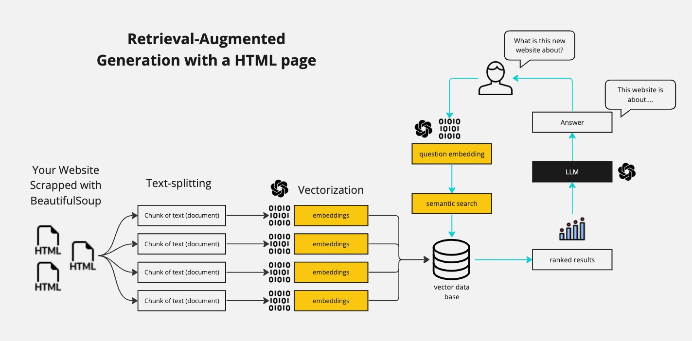
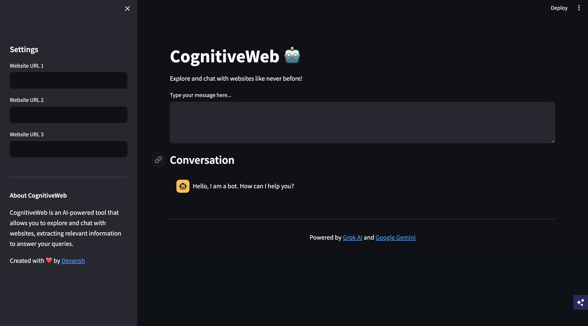

#  CognitiveWeb 🤖
##    Intelligent Chatbot for Dynamic Web Content Analysis 

CognitiveWeb is a powerful and innovative AI-powered chatbot that revolutionizes the way we interact with web content. Combining cutting-edge technologies such as Grok AI, LangChain, Google Generative AI, and Streamlit, CognitiveWeb provides a seamless and intuitive experience for users to explore and analyze web content in real-time.

## Table of Contents
- [Introduction](#introduction)
- [Features](#features)
- [Installation](#installation)
- [Usage](#usage)
- [How It Works](#how-it-works)
- [Demonstration Video](#demonstration-video)
- [Contributing](#contributing)

## Introduction

This project aims to create an intelligent chatbot capable of understanding and answering queries based on the content of websites. Leveraging the power of Retrieval-Augmented Generation (RAG), CognitiveWeb fetches relevant information from websites, processes it using Natural Language Processing (NLP) techniques, and generates accurate and contextual responses.

## Features

- **Real-time Web Scraping**: Utilizes web scraping libraries to fetch and process dynamic web content in real-time, ensuring access to the latest information.
- **Grok AI Integration**: Employs Grok AI, a state-of-the-art language model, for natural language understanding and generation, enabling seamless and intelligent conversations.
- **LangChain Integration**: Incorporates LangChain, a powerful framework for building applications with large language models, facilitating efficient information retrieval and generation.
- **Google Generative AI Embeddings**: Utilizes Google Generative AI embeddings to vectorize web content, enabling efficient similarity search and retrieval of relevant information.
- **Streamlit GUI**: Features a user-friendly Streamlit graphical user interface (GUI), providing an intuitive and visually appealing experience for users to interact with the chatbot.

## Installation

1. **Clone the Repository:**
    ```bash
   https://github.com/devansh1401/CognitiveWeb.git
    ```

2. **Navigate to the Project Directory:**
    ```bash
    cd cognitivewebchatbot
    ```

3. **Create a Virtual Environment and Activate it:**
    ```bash
    python -m venv my-venv
    source env/bin/activate  # On Windows, use `env\Scripts\activate`
    ```

4. **Install Dependencies:**
    ```bash
    pip install -r requirements.txt
    ```

5. **Set Up Environment Variables:**
    - Create a `.env` file in the project root directory.
    - Add your Google API key to the file:
        ```
        GOOGLE_API_KEY=your_google_api_key
        GROQ_API_KEY=your_groq_api_key
        ```

    You can get your Grok API key [here](https://wow.groq.com/).
    For Gemini API key, refer to [this YouTube video](https://youtu.be/a_vuUufkCy4?si=EvX9I9eoUBDnf3df).

## Usage

1. **Start the Streamlit Application:**
    ```bash
    streamlit run src/app.py
    ```

2. The application will open in your default web browser. If not, you can access it by navigating to the URL provided in the terminal output.
3. In the sidebar, enter the URLs of the websites you want to analyze.
4. Type your queries in the input field, and the chatbot will generate relevant responses based on the website content and your conversation history.

## How It Works


CognitiveWeb leverages the power of Retrieval-Augmented Generation (RAG) to fetch and process web content. Here's a brief overview of the process:
- **Web Scraping**: Scrapes specified website URLs using web scraping libraries like BeautifulSoup, extracting HTML content.
- **Text Splitting**: Splits the HTML content into smaller text chunks using a recursive character text splitter.
- **Vectorization**: Vectorizes text chunks using Google Generative AI embeddings, creating numerical representations.
- **Vector Data Store**: Stores vectorized text chunks in a vector data store (e.g., Chroma) for similarity search and retrieval.
- **Query Handling**: Generates search queries based on conversation history using a large language model (LLM) from Grok AI.
- **Semantic Search**: Finds the most relevant text chunks from the vector data store through semantic search.
- **Context Generation**: Combines retrieved text chunks and passes as context to the LLM, along with the user's query and conversation history.
- **Response Generation**: Generates contextual and relevant responses based on the provided context, query, and conversation history.
- **User Interface**: Displays the generated response in the Streamlit GUI for seamless conversation continuation.

## Demonstration Video

Watch the demonstration video to see CognitiveWeb in action:

[](https://www.linkedin.com/feed/update/urn:li:activity:7184972097595535361/)


## Contributing

Contributions to CognitiveWeb are welcome! If you encounter any issues or have ideas for improvements, please open an issue or submit a pull request. Ensure to follow the project's coding standards and guidelines.


